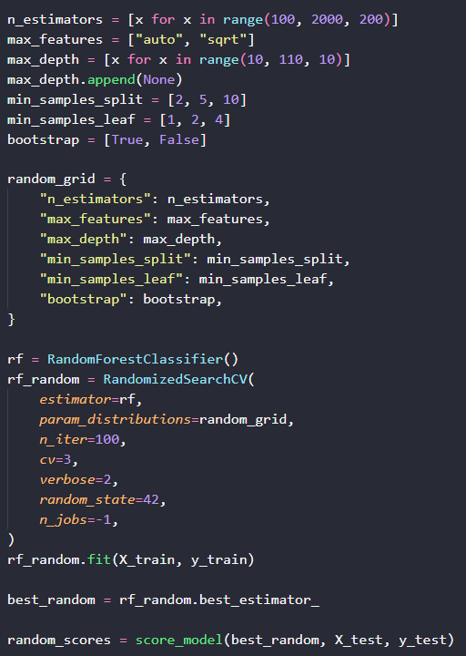
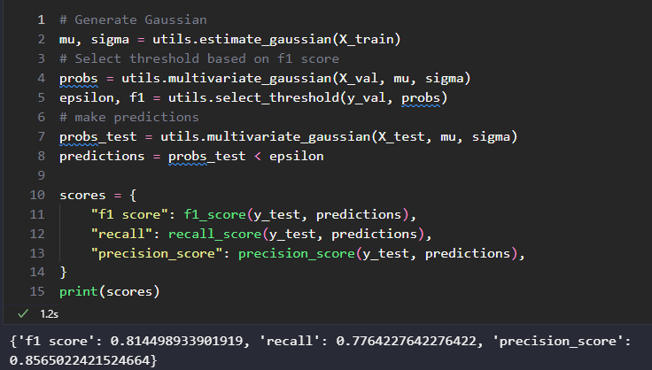
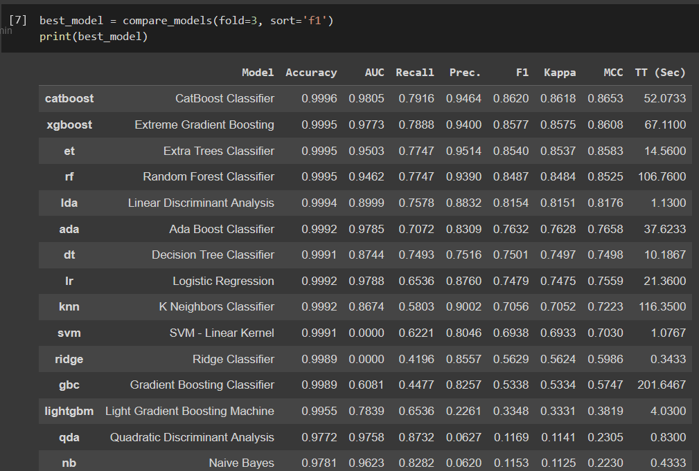

# Table of Contents
- [Table of Contents](#table-of-contents)
- [Introduction](#introduction)
- [The Dataset](#the-dataset)
  - [Description](#description)
  - [Descriptive Statistics](#descriptive-statistics)
- [Machine Learning Modelling](#machine-learning-modelling)
  - [Random Forest](#random-forest)
    - [Random Search and Grid Search](#random-search-and-grid-search)
  - [Anomaly Detection](#anomaly-detection)
  - [Pycaret](#pycaret)
  - [Is the model worth it to the company?](#is-the-model-worth-it-to-the-company)

# Introduction
In this project I have made some experiments using Random Forest, Anomaly Detection and Pycaret in order to predict whenever a transaction is fraudulent or legitimate.

# The Dataset

## Description
The [Dataset used](https://www.kaggle.com/datasets/mlg-ulb/creditcardfraud) in this project contains real transactions made by credit cards in September 2013 in European cardholders. With only 492 frauds out of 284.807 transactions, the data is highly unbalanced with just 0.173% of frauds of all transactions.

It contains only numerical input variables which are the result of a PCA transformation. Due to confidentiality issues, the company can not provide the original features and more background information about the data. Features V1, V2, ..., V28 are the principal components obtained with PCA. The only features which have not been transformed with PCA are "Time" and "Amount". Therefore, we have a total of 30 features. Time contains the seconds elapsed between each transaction and the first transaction in the dataset. Amount stands for transaction amount. Finally, the feature "Class" is the response variable and it takes value 1 in case of fraud and 0 otherwise.

|  |
| :---------------------------------: |
|            Dataset info             |

## Descriptive Statistics

Since the features available in this dataset are resultant from PCA and we do not have the eigenvectors space used in this transformation, it does not make sense to analyze some statistics like mean, median, standard deviation and so on.

# Machine Learning Modelling
In this section, I will make some experiments trying to predict fraud in credit card transactions.

## Random Forest
I started by exporting some essential libraries

|  |
| :---------------------------------: |
|           Basic imports             |

Here `SplitData` is a module that I created to read and split the data. In this case, a trivial [sklearn.model_selection.train_test_split](https://scikit-learn.org/stable/modules/generated/sklearn.model_selection.train_test_split.html) with test size of 15% is made, further I will need a more complex function, that is the reason this module exist.

As you can see in the file [`exp_01_random_forest.py`](models\exp_01_random_forest.py), I made a standard `RandomForest` model that give us the confusion matrix below

|  |
| :---------------------------------: |
|          Confusion Matrix           |

and the following scores (score_model function is defined in the [`exp_01_random_forest.py`](models\exp_01_random_forest.py))

|  |
| :---------------------------------: |
|         Random Forest Score         |

### Random Search and Grid Search
In order to tune the model, I first made a _Random Search_, which selects the best model over `n_iter` random runs of a given parameters space (in our case named `random_grid`).

|  |
| :---------------------------------: |
|             Random Search           |

The best model yields the scores below, which are a little bit worse than the standard _Random Forest_ scores.

|  |
| :---------------------------------: |
|   Random Search best model scores   |

I grabbed the best model (`best_random`) and then did a _Grid Search_ around its parameters,

|  |
| :---------------------------------: |
|              Grid Search            |

which produced worst scores than standard _Random Forest_ again.

|  |
| :---------------------------------: |
|              Grid Search            |

Unfortunately, we did not find a better set of parameters that improved our model. So, I will save the random forest and go on to the next experiment.

## Anomaly Detection
In order to find a better model to fit our data, this experiment involves _Supervised Anomaly Detection_. Before starting, I will refresh the concept of  _Anomaly Detection_ with _Gaussian Distribution_.

In this approach, all features are modeled by a _Gaussian Distribution_ and given a new data point, the method measures the relative likelihood that the value of the random variable would be equal to that point. If this probability is below a particular threshold, then we say that such point has a very small probability to belong to our _Gaussian Distribution_, in this case we label this new data point as _Anomalous_ or _Outlier_.

According to one dimensional _Gaussin Distribution_, the probability of $x$ occurs is given by:
$$
p(x, \mu, \sigma) = \frac{1}{\sqrt{2 \pi} \sigma}exp\left(-\frac{(x - \mu)^2}{2\sigma^2}\right),
$$
or in $n$ dimensional space
$$
p(\{x^j\}) = \prod_{j=1}^{n}p(x^j, \mu^j, \sigma^j),
$$
where $\{x^j\} = x^1, x^2, \dots, x^n$.

In the general case with $n$ features and $m$ example, $\mu_j$ is the mean of each feature ($j \in [1, n]$)
$$
\mu^j = \frac{1}{m}\sum_{i=1}^{m}x_i^{j},
$$
and the variance for each feature is 
$$
(\sigma^{j})^2 = \frac{1}{m}\sum_{i=1}^{m}\left( x_i^{j} - \mu^{j}  \right).
$$
This is what is precisely done by the function `estimate_gaussian` in [utils.py](./models/utils.py).

Then, I split the data in such way that X_train is a subset of all __not fraud__ data. In other words, our _Gaussian_ is constructed with just legit transactions. Validation and test sets have both, fraud and not fraud examples. In addiction to that, I selected a small group of features based on _Random Forest_ feature importances.

|  |
| :---------------------------------: |
|Anomaly Detection features used. Data have been splited accordly with [anomaly_split](./models/split_data.py)|

After that, I used the validation set to test a variety of thresholds, then selected the one with highest f1_score. Now that we have our _Gaussian_ and our threshold, I just made some predictions on the test set and this is the obtained score from _Anamoly Detection_.

|  |
| :---------------------------------: |
|Anomaly Detection features used. Data have been splited accordly with [anomaly_split](./models/split_data.py)|

As you can see, the scores are not so bad but _Random forest_ still presents a better performance.

## Pycaret
A more straightforward way to find a potential best model is using [pycaret](https://pycaret.org/): a low-code machine learning library that automates machine learning workflows.

I used this to explore a bunch of models and see which one performs better.

First things first, I split our data in train, validation and test set, then I set up pycaret.

|  |
| :---------------------------------: |
|_Pycaret_ setup using train and validation set|

After that, we got _Catboost Classifier_ with the best f1-score and very good recall. _Quadratic Discriminant Analysis_ and _Naive Bayes_ have better recall but poor precision which results in a very low f1-score.

|  |
| :---------------------------------: |
|_Pycaret_ models comparison|

Next, I created a catboost model with _Pycaret_, unfortunately the `tune_model` function from _Pycaret_ does not improve our model, so the best results is the standards one shown in ten folds below.

|  |
| :---------------------------------: |
|_Pycaret_ catboost cross validation|

Now that I already have used the train and validation set to select the model, it is time to see how our model performs on the test set.

|  |
| :---------------------------------: |
|_Pycaret_ best model metrics|

|  |
| :---------------------------------: |
|_Pycaret_ best model confusion matrix|

Compared with the other experiments, this is the best scores we have so far.
## Is the model worth it to the company?
To answer this question I will assume that the company has not any model, therefore we do not have any information to compare. In other words, let's consider two scenarios.

>Scenario A: the company will approve all transactions.
>
>Scenario B: the company will approve just the transactions approved by our model.

To analyze that, we need to look at every mistake made by the model to see the types of mistakes our models makes. I put the predicted label (`Label`) side by side with the real label (`y_true`). As shown in the figure below, most of the errors are type II (false negative).

|  |
| :---------------------------------: |
|df_error has amount, model label and true label of the examples not captured by our model|

If the company had approved every transaction, the amount of money they would lose is the sum of every fraudulent transaction in the test set. On the other hand, if our model was in production, the amount of money lost by the company would be the sum of the Amount in `df_error`. Note that we are adding the full amount of errors related to non-fraudulent examples.

|  |
| :---------------------------------: |
|Amount and relative reduction using our model|

The model selected here provided almost 4x reduction if compared with no model being used.

